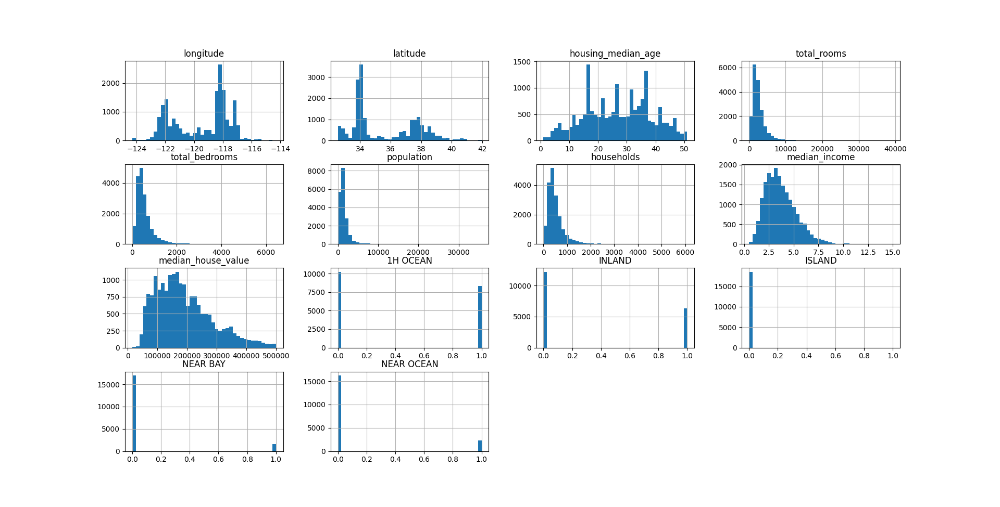
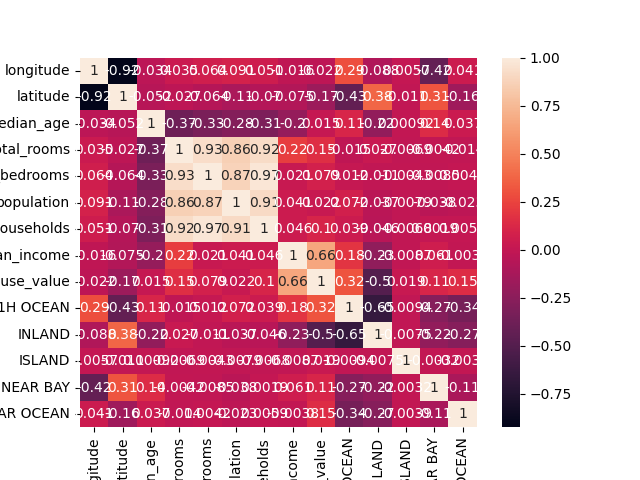

# California Housing Prices Prediction
```
import pandas as pd
import matplotlib.pyplot as plt
import numpy as np
from scipy.stats import pearsonr
import statistics
from scipy.stats import shapiro
import seaborn as sns
```

##                                                             Data read and preprocessing
```
data = pd.read_csv(r'C:\Users\milosz.groch\Desktop\Programming\Kaggle\Simple ML\housing.csv')
data.info()
```
```
>>> data.info()
<class 'pandas.core.frame.DataFrame'>
RangeIndex: 20640 entries, 0 to 20639
Data columns (total 10 columns):
 #   Column              Non-Null Count  Dtype
---  ------              --------------  -----
 0   longitude           20640 non-null  float64
 1   latitude            20640 non-null  float64
 2   housing_median_age  20640 non-null  float64
 3   total_rooms         20640 non-null  float64
 4   total_bedrooms      20433 non-null  float64
 5   population          20640 non-null  float64
 6   households          20640 non-null  float64
 7   median_income       20640 non-null  float64
 8   median_house_value  20640 non-null  float64
 9   ocean_proximity     20640 non-null  object
dtypes: float64(9), object(1)
memory usage: 1.6+ MB
```

### Ocean Proximity is an object with 5 different values so we will create 5 separate numerical columns for each value
```
dummies = pd.get_dummies(data['ocean_proximity'])
data = pd.concat([data, dummies], axis=1)
data = data.rename(columns={'<1H OCEAN':'1H OCEAN'})
print(data.columns)
```
```
>>> print(data.columns)
Index(['longitude', 'latitude', 'housing_median_age', 'total_rooms',
       'total_bedrooms', 'population', 'households', 'median_income',
       'median_house_value', 'ocean_proximity', '1H OCEAN', 'INLAND', 'ISLAND',
       'NEAR BAY', 'NEAR OCEAN'],
      dtype='object')
```
### Now we can drop ocean_proximity column
```
data = data.drop('ocean_proximity', axis=1)
```
### Let's check the NA's
```
missings = data.isna().sum()
print(missings)
```
```
>>> print(missings)
longitude               0
latitude                0
housing_median_age      0
total_rooms             0
total_bedrooms        207
population              0
households              0
median_income           0
median_house_value      0
1H OCEAN                0
INLAND                  0
ISLAND                  0
NEAR BAY                0
NEAR OCEAN              0
dtype: int64
```
### We have 207 NA's in "total bedrooms" column. We could drop the data that contains NA's but better approach is to impute the missing values. We will use the median for total_bedrooms
```
median = statistics.median(data['total_bedrooms'])
data['total_bedrooms'].fillna(median, inplace=True)
```

##                                                              EXPLORATORY DATA ANALYSIS

### Now we wants to check:
### A) Data distribution (For example lineal regression needs normal distribution)
### B) Outliers
### C) Data abnormalities

### To check that let's do:

### 1) Histogram
```
data.hist(figsize=(20,10), bins=40)
plt.show()
```



### 2) Shapiro test if all data is normally distributed
```
norm = data.apply(lambda x: shapiro(x))
print(norm)
```
```
>>> print(norm)
   longitude  latitude  housing_median_age  total_rooms  total_bedrooms  population  households  median_income  median_house_value  1H 
0   0.896999   0.87711            0.978237     0.695245        0.732969    0.713316    0.745649       0.893232            0.912302  0.6
1   0.000000   0.00000            0.000000     0.000000        0.000000    0.000000    0.000000       0.000000            0.000000  0.0

```
### No values under p=0.05 so every column has normal distribution

#### 3) Correlation matrix
```
correlation = data.corr()
print(correlation)
```
```
>>> print(correlation)
                    longitude  latitude  housing_median_age  total_rooms  total_bedrooms  population  households  median_income  median
longitude            1.000000 -0.924664           -0.108197     0.044568        0.068920    0.099773    0.055310      -0.015176        
latitude            -0.924664  1.000000            0.011173    -0.036100       -0.066248   -0.108785   -0.071035      -0.079809        
housing_median_age  -0.108197  0.011173            1.000000    -0.361262       -0.318839   -0.296244   -0.302916      -0.119034        
total_rooms          0.044568 -0.036100           -0.361262     1.000000        0.926213    0.857126    0.918484       0.198050        
total_bedrooms       0.068920 -0.066248           -0.318839     0.926213        1.000000    0.872529    0.973309      -0.007541        
population           0.099773 -0.108785           -0.296244     0.857126        0.872529    1.000000    0.907222       0.004834        
households           0.055310 -0.071035           -0.302916     0.918484        0.973309    0.907222    1.000000       0.013033        
median_income       -0.015176 -0.079809           -0.119034     0.198050       -0.007541    0.004834    0.013033       1.000000        
median_house_value  -0.045967 -0.144160            0.105623     0.134153        0.049427   -0.024650    0.065843       0.688075        
1H OCEAN             0.321121 -0.446969            0.045300    -0.003031        0.017677    0.074613    0.042435       0.168876        
INLAND              -0.055575  0.351166           -0.236645     0.025624       -0.005853   -0.020732   -0.039402      -0.237496        
ISLAND               0.009446 -0.016572            0.017020    -0.007572       -0.004276   -0.010412   -0.009077      -0.009228        
NEAR BAY            -0.474489  0.358771            0.255172    -0.023022       -0.019524   -0.060880   -0.010093       0.056197        
NEAR OCEAN           0.045509 -0.160818            0.021622    -0.009175        0.000427   -0.024264    0.001714       0.027344        
```
```
sns.heatmap(correlation, annot=True)
plt.show()
```


#### The only significantly correlated variable with median_house_value is median_income. We have some low correlation variables but we'll leave them for now. We can experiment with them later

#### We noticed in the previous histogram that values in the housing_median_age and median_house_value columns look like outliers so we will drop them
```
max_hous = data['housing_median_age'].max()
max_med = data['median_house_value'].max()

data = data[data['housing_median_age'] != max_hous]
data = data[data['median_house_value'] != max_med]
```

##                                                                 Data Splitting

```
from sklearn.model_selection import train_test_split

y = data['median_house_value']
x = data.drop('median_house_value', axis=1)

x_train, x_test, y_train, y_test = train_test_split(x, y, test_size=0.1, random_state=1000)
```

##                                                                 Model Building and Performance

```
from sklearn.ensemble import RandomForestRegressor
from sklearn.linear_model import LinearRegression
from sklearn.svm import SVR
from xgboost import XGBRegressor
from sklearn.linear_model import Ridge
from sklearn.linear_model import ElasticNet
from sklearn.linear_model import BayesianRidge
from sklearn.neighbors import KNeighborsRegressor
from sklearn.metrics import mean_squared_error,r2_score
```

```
models = {'rf': RandomForestRegressor(), 'lr': LinearRegression(), 'svr': SVR(), 'XGB': XGBRegressor(), 'Ridge': Ridge(), 'en': ElasticNet(), 'Bayesian': BayesianRidge(), 'KN': KNeighborsRegressor()}
results = []
```

```
for name, model in models.items():
    model.fit(x_train,y_train)
    y_train_pred = model.predict(x_train)
    y_test_pred = model.predict(x_test)
    MSE_train = mean_squared_error(y_train, y_train_pred, squared=False)
    R2_train = r2_score(y_train, y_train_pred)
    MSE_test = mean_squared_error(y_test, y_test_pred, squared=False)
    R2_test = r2_score(y_test, y_test_pred)
    results.append([name, MSE_train, R2_train, MSE_test, R2_test])

results_df = pd.DataFrame(results, columns=['Model','MSE_train','R2_train','MSE_test','R2_test'])
```

```
results_df = results_df.round(2)
results_df = results_df.applymap(lambda x: '{:,.2f}'.format(x) if isinstance(x, (float, float)) else x)
print(results_df)
```
```
>>> print(results_df)
      Model  MSE_train R2_train   MSE_test R2_test
0        rf  16,199.51     0.97  43,844.51    0.79
1        lr  58,996.43     0.62  58,246.19    0.63
2       svr  97,451.51    -0.03  97,096.39   -0.03
3       XGB  26,078.19     0.93  41,178.06    0.81
4     Ridge  58,999.66     0.62  58,246.38    0.63
5        en  61,973.07     0.58  61,425.90    0.59
6  Bayesian  59,016.90     0.62  58,246.95    0.63
7        KN  71,983.11     0.44  88,420.96    0.15
```
### With similar results for RF and XGB we are gonna continue with them only

### I will continue this project with model tuning
